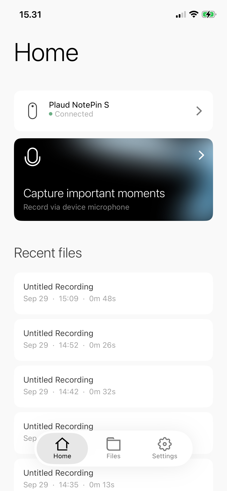
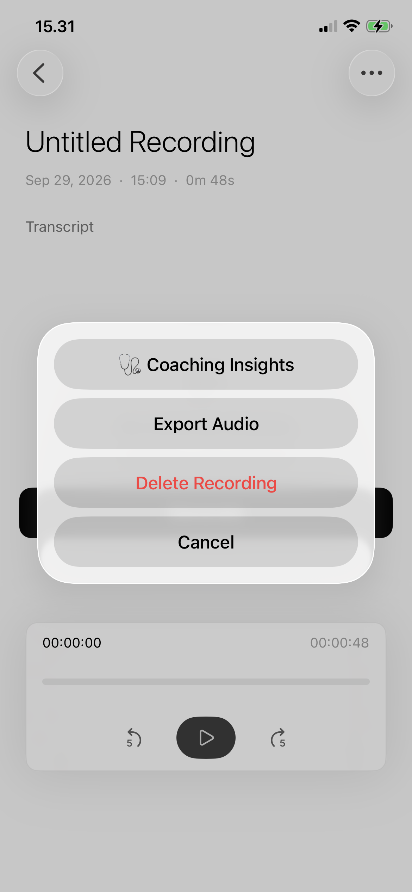
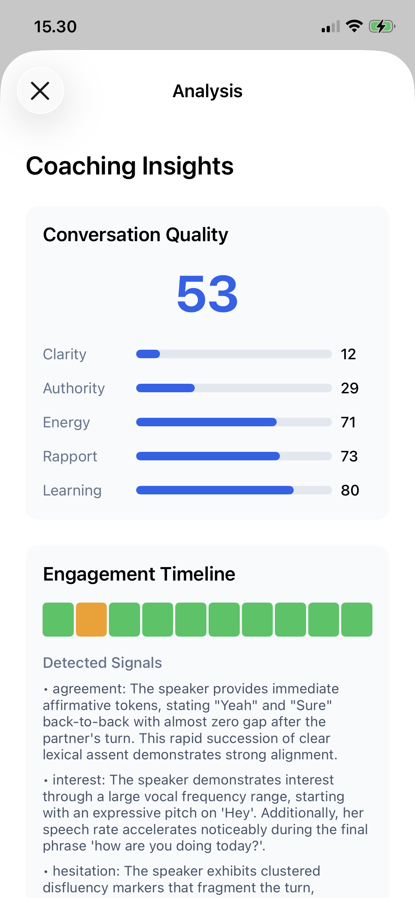

# CareCompass

**AI Shadow Coach for Healthcare Providers**

CareCompass turns every patient conversation into measurable quality improvement. It provides continuous, AI-powered feedback to healthcare providers after every patient interaction - improving patient satisfaction, patient adherence, and clinical outcomes without adding to provider workload.

## Screenshots

<p align="center">
  
  
  
</p>

**Left:** Home screen with connected Plaud NotePin S and recent recordings  
**Center:** Recording detail with "Coaching Insights" action  
**Right:** AI-generated coaching insights with conversation quality scores, engagement timeline, and detected social signals

## Architecture

```
┌─────────────────┐     ┌─────────────────┐     ┌─────────────────┐
│   Plaud Device  │────▶│    iOS App      │────▶│  Backend API    │
│  (Recording)    │     │  (Sync + UI)    │     │  (FastAPI)      │
└─────────────────┘     └─────────────────┘     └────────┬────────┘
                                                         │
                        ┌────────────────────────────────┼────────────────────────────────┐
                        │                                │                                │
                        ▼                                ▼                                ▼
               ┌─────────────────┐             ┌─────────────────┐             ┌─────────────────┐
               │  Plaud API      │             │ Interhuman AI   │             │ Crusoe Inference│
               │ (Transcription) │             │ (Social Signals)    │             │ (Coaching)      │
               └─────────────────┘             └─────────────────┘             └─────────────────┘
```

## Components

### iOS App (`ios-plaud-sdk/`)
- Built on Plaud's template app with Embedded SDK
- Connects to Plaud devices via BLE/WiFi
- Syncs recordings and sends to backend for analysis
- Displays analysis results and coaching insights

### Backend API (`backend/`)
- FastAPI server orchestrating the analysis pipeline
- Integrates four services:
  - **Plaud Transcription API**: Speech-to-text with speaker diarization
  - **Interhuman AI API**: Engagement analysis and conversation quality
  - **Crusoe Inference API**: LLM-powered coaching generation
  - **Neo4j Knowledge Graph**: Track provider improvement over time

## Quick Start

### Prerequisites
- Mac with Xcode 16.0+ and XcodeGen (`brew install xcodegen`)
- Physical iPhone running iOS 14+
- Python 3.11+
- API credentials (see below)

### 1. Set Up Credentials

**Plaud** (from [portal.plaud.ai](https://portal.plaud.ai)):
- `CLIENT_ID` - Identifies your application
- `SECRET_KEY` - Used to mint user tokens (partner auth)
- `API_KEY` - Used for Transcription API calls

**Interhuman AI**:
- API Key with `interhumanai.upload.inter-2-audio` scope

**Crusoe** (from [console.crusoecloud.com](https://console.crusoecloud.com)):
- Inference API Key

**Neo4j** (optional, from [console.neo4j.io](https://console.neo4j.io)):
- AuraDB Free instance URI, username, and password
- Used to track provider improvement over time

### 2. Configure Backend

```bash
cd backend
cp .env.example .env
# Edit .env with your credentials

python -m venv venv
source venv/bin/activate
pip install -r requirements.txt

# Run the server
uvicorn app.main:app --reload
```

### 3. Generate Plaud User Access Token

The iOS SDK requires a per-user JWT token. Generate one using your Plaud credentials:

```bash
# From project root
npx tsx scripts/get-plaud-user-token.ts
```

This uses your `PLAUD_CLIENT_ID` and `PLAUD_SECRET_KEY` to:
1. Get a partner access token (Basic auth)
2. Mint a user access token (valid for 24 hours)

The token is printed to stdout - copy it to your iOS config.

### 4. Configure iOS App

```bash
cd ios-plaud-sdk/ios

# Create local config with your Plaud credentials
cat > PartnerConfig.local.xcconfig << EOF
USER_ACCESS_TOKEN = <paste token from step 3>
PLAUD_CLIENT_ID = your_client_id
PLAUD_API_KEY = your_api_key
EOF

# Generate Xcode project
xcodegen

# Open in Xcode
open PlaudTemplateApp.xcodeproj
```

> **Note:** `PartnerConfig.local.xcconfig` is gitignored. The `USER_ACCESS_TOKEN` expires in 24 hours - regenerate with `npx tsx scripts/get-plaud-user-token.ts`.

### 5. Run

1. Start the backend: `uvicorn app.main:app --reload`
2. Build and run the iOS app on your physical iPhone
3. Pair your Plaud device
4. Record a conversation
5. Sync and analyze!

## API Endpoints

### Sessions
- `POST /sessions/` - Create a new session
- `POST /sessions/{id}/upload` - Upload audio for analysis
- `GET /sessions/{id}` - Get session with analysis results
- `GET /sessions/` - List sessions

### Dashboard
- `GET /dashboard/metrics/{provider_id}` - Provider metrics
- `GET /dashboard/metrics` - All provider metrics

## Analysis Pipeline

1. **Transcription** (Plaud): Audio → text with speaker IDs and timestamps
2. **Engagement Analysis** (Interhuman AI): 
   - Per-window engagement status (engaged/neutral/disengaged)
   - Social signals (confidence, hesitation, confusion, etc.)
   - Conversation Quality Index (clarity, authority, energy, rapport, learning)
3. **Coaching Generation** (Crusoe):
   - LLM analyzes transcript + engagement data
   - Generates 2-3 specific, actionable coaching insights
4. **Knowledge Graph** (Neo4j, optional):
   - Store sessions, quality scores, and coaching insights
   - Track provider improvement trends over time
   - Identify recurring coaching themes

## Neo4j Knowledge Graph

When configured, CareCompass stores analysis results in a Neo4j graph:

```
(:Provider)-[:CONDUCTED]->(:Session)-[:HAS_QUALITY]->(:QualityScore)
                                    -[:GENERATED]->(:CoachingInsight)
                                    -[:HAS_SIGNAL]->(:SocialSignal)
```

### Graph API Endpoints
- `GET /dashboard/graph/trends/{provider_id}` - Quality score trends over time
- `GET /dashboard/graph/themes/{provider_id}` - Recurring coaching themes
- `GET /dashboard/graph/signals/{provider_id}` - Social signal patterns

## Market Research

See [`research/MARKET_RESEARCH.md`](research/MARKET_RESEARCH.md) for competitive analysis using Similarweb data.

## Next Steps & Testing

### UserTesting Integration (Recommended)

Before major releases, validate the user experience with real healthcare professionals:

1. **Create a UserTesting study** at [usertesting.com](https://www.usertesting.com)
2. **Target audience**: Healthcare providers (physicians, nurses, medical assistants)
3. **Key tasks to test**:
   - Device pairing flow
   - Recording sync experience
   - Coaching insights comprehension
   - Actionability of recommendations

**Automated Testing Pipeline** (Future):
```yaml
# Example CI integration
on:
  release:
    types: [created]
jobs:
  usertesting:
    runs-on: ubuntu-latest
    steps:
      - name: Trigger UserTesting Study
        run: |
          curl -X POST https://api.usertesting.com/v1/studies \
            -H "Authorization: Bearer ${{ secrets.USERTESTING_API_KEY }}" \
            -d '{"template_id": "healthcare-provider-test"}'
```

## License

MIT
